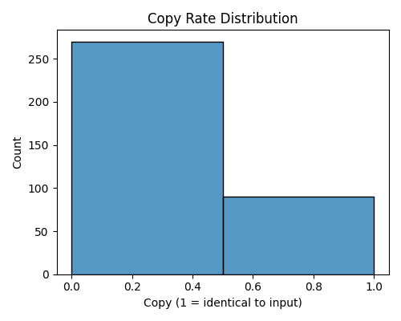
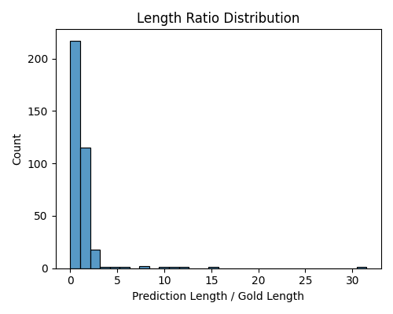
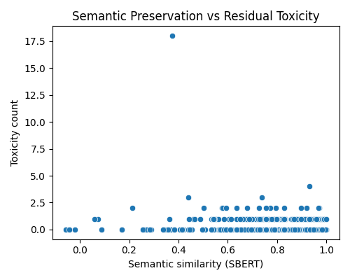

# Evaluation Report

## Global Metrics

- **copy_rate**: 0.2500
- **bertscore_f1**: 0.8546
- **sbert_similarity**: 0.7572
- **bleu**: 48.3270
- **chrf**: 72.2326
- **length_ratio**: 1.3572
- **residual_toxicity**: 0.0462
- **semantic_drift**: 0.8782

---
## Visualizations

### Copy Rate Histogram

### Length Ratio Distribution

### Semantic Similarity vs Residual Toxicity

